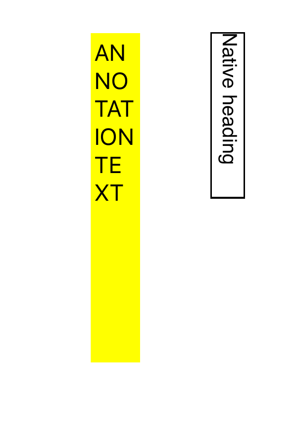
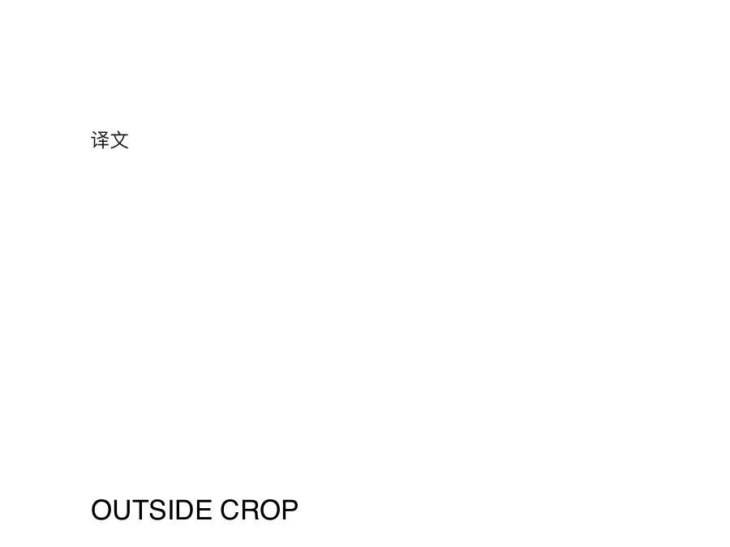

# Transall 项目复查 · 2026-09-05

**判断：Transall 已有扎实的原生应用基础，但文档输出的质量承诺还没有得到充分验证。下一阶段应优先修正输出，再改善检查结果的体验。**

界面风格基本成立：浅色纸面、克制的暖色和格式圆盘具有一致性，不需要推翻重做。当前的不足主要是操作围绕格式和参数组织，原文、译文和页面本身还没有成为工作区的中心。

检查对象为 `main` 的 `bb6244217e983fbd7448241eaa120e2eef93e81d`。原生应用是主线，Python 浏览器版是独立实现。本次读取代码、重新构建并查看原生界面，运行本地验证、查询当前提交的远端 CI，并编译生产代码生成 PDF 复现样本。工作区已有的图标和设计文件改动保留。本次只增加复查报告和证据，没有修改产品实现。

后续修复、当前验证及剩余限制见 [修复记录](2026-09-05-fixes.md)。本报告保留修复前的检查结果。

## 最重要的发现

| 编号 | 级别 | 已确认的问题 | 用户影响 |
|---|---|---|---|
| R1 | P1 | 保留版式输出丢失页面旋转、裁剪和批注 | 页面方向改变，原先裁掉的内容重新可见，链接和批注消失 |
| R2 | P1 | OCR 去重只因文字相同就跳过不同位置的区域 | 正文与插图中相同的标签可能漏译，任务仍然成功 |
| R3 | P1 | Markdown 转 PDF 不解析 Markdown | 标题、粗体和表格变成原始标记文本 |
| R4 | P1 | 当前提交的完整 CI 失败 | 支持站依赖检查和 Python 静态检查阻止完整验证通过 |
| R5 | P2 | 字号缩小被当作可读性保证 | 复现样本生成 5 pt 译文且无溢出告警，代码下限为 4 pt |
| R6 | P2 | 遮盖原文后仍保留原始文字对象 | 提取文本包含看不见的原文，复制、搜索和再次处理可能混入双份内容 |
| R7 | P2 | 核心参数和页面检查入口不充分 | 翻译语言藏在高级参数内，结果只提供小缩略图，难以检查错译和拥挤排版 |
| R8 | P2 | 审计文档的发布判断和远端状态过时 | “20/20、无问题、尚未推送”的说法会误导后续发布决策 |

共 0 P0、4 P1、4 P2、0 P3。这里的 P1 指发布前应解决的明确缺陷或验证阻碍，不等同于所有问题都构成可利用的安全漏洞。

## 验证记录

| 检查 | 本次结果 |
|---|---|
| 严格 SwiftPM 测试 | 169/169；严格并发与警告视为错误 |
| Xcode Scheme 测试 | 169/169；读取 `.xcresult` 确认，0 失败、0 跳过 |
| Release 静态分析 | 成功 |
| Swift 格式检查 | 通过 |
| XcodeGen 生成项目一致性 | 通过 |
| 发布元数据检查 | 通过；36 组校验器夹具通过 |
| Python 测试 | 121/121，通过锁定依赖的 uv 环境运行 |
| 当前提交远端 `native-macos` | 成功 |
| 当前提交远端完整 `tests` | 失败：支持站 npm audit 和 Python Bandit |
| 本次 npm audit | 1 high（browserslist）、1 moderate（fflate），均报告有修复版本 |
| 本次 Bandit | 3 LOW：2 个 B404、1 个 B603，退出码 1 |
| 本机原生界面 | 新构建的 Release 应用启动、格式选择、翻译选项及无障碍树检查通过 |
| PDF 行为探针 | 复现 R1、R2、R3、R5、R6，结果见 JSON 和 PDF |

远端证据：[当前提交的 tests 工作流](https://github.com/oasis-zepher/transall/actions/runs/33597971095)。9 月 2 日运行时支持站报告 1 个 high；9 月 5 日重新查询 npm 时还出现 1 个 moderate，不能混用两次结果。

没有进行真实服务商付费翻译、翻译准确率评估、签名归档或 App Store 提交。本次也没有完成 macOS 14 最低系统、Intel 实机、完整 VoiceOver 或所有大字号窗口组合的验证；当前测试机器为 arm64 / macOS 27.0，工具链为 Xcode 26.6。

## 具体问题与修正方向

### R1 · P1 · 页面属性和批注丢失

位置：[PDFLayoutTranslation.swift:218](../../native/TransallMac/Sources/TransallMac/PDFLayoutTranslation.swift)。类别：输出正确性。

输出通过 `drawPDFPage` 重画内容，只设置 MediaBox，再创建新 PDFPage；没有保留 CropBox、Rotate 或 annotations。样本输入 Rotate=90、CropBox={{20,40},{270,180}}、2 个批注，输出 Rotate=0、CropBox={{0,0},{320,240}}、0 个批注。输出无溢出，原先裁剪掉的 `OUTSIDE CROP` 重新可见。

修正应分别定义页面几何、可见内容和交互对象的保留规则，验证旋转与非零页面原点的坐标变换，复制或明确处理批注与链接。验收应同时检查页面字典、页面图像、文本和链接行为。

| 输入 | 当前输出 |
|---|---|
|  |  |

### R2 · P1 · 不同位置的相同文本被误去重

位置：[PDFLayoutTranslation.swift:147](../../native/TransallMac/Sources/TransallMac/PDFLayoutTranslation.swift)。类别：内容完整性。

文本标准化相同就直接跳过，位置重叠判断在之后。因此正文标题与图内标签相同也可能被视为重复。探针注入一个与原生文字不重叠、内容相同的有效 OCR 观察，输入 1 个 OCR 区域，保留 0 个。这是提取后去重算法的确定性复现，不是对 Vision 实际识别准确率的测量。

去重应联合使用空间重叠和文本相似度。回归应包括同位置双文字层、异位置重复标签、表格重复值、OCR 仅覆盖部分原生文字等情况。

### R3 · P1 · Markdown 路径输出原始语法

位置：[NativeDocumentProcessor.swift:628](../../native/TransallMac/Sources/TransallMac/NativeDocumentProcessor.swift)。类别：功能正确性与命名。

Markdown 原文直接传入统一文本排版器。实际导出的 PDF 保留 `# Report`、`**Important**`、`| Item | Value |` 等符号，没有标题、粗体或表格语义。浏览器版有独立渲染实现，其能力不能用来描述原生版。

应实现与承诺相符的 Markdown 文档结构和排版；在达到该标准前，应明确标注为“Markdown 源码转 PDF”。HTML 和数据路径也需要分别定义可保留内容，不能以文件成功写出作为唯一验收。

样本：[Markdown 输出 PDF](../../output/pdf/project-review-2026-09-05/markdown-output.pdf)。

### R4 · P1 · CI 实际未通过

位置：[tests.yml:29](../../.github/workflows/tests.yml)、[package-lock.json](../../store/support-site/package-lock.json)。类别：发布验证。

当前提交的原生任务成功，Python 121 项测试也成功；Python job 随后被 Bandit 的三项 LOW 告警停止，后面的 pip-audit 没有在该远端运行中执行。支持站被 browserslist 高危依赖告警停止，后续 lint 和 build/test 被跳过。本次重跑确认 Bandit 仍失败，npm 目前还有 fflate 的 moderate 告警。

需更新受影响依赖并验证锁文件和构建；逐项审查 Python subprocess 的输入来源、命令构造和 shell 使用，针对可证明安全的调用记录明确理由，不能为通过 CI 全局关闭检测。供应链告警属于支持站依赖，不能直接表述为原生 App 携带该漏洞。

### R5 · P2 · 排得下不代表读得清

位置：[PDFLayoutTranslation.swift:386](../../native/TransallMac/Sources/TransallMac/PDFLayoutTranslation.swift)。类别：输出可读性。

算法每次缩小 0.5 pt，直到 4 pt；只检查 Core Text 可见字符串长度。探针中 40 个汉字放进 100×14 pt 区域，输出字号 5 pt，仍无溢出。没有按正文、脚注、图中文字区分可读性要求。

应定义绝对字号与相对缩小比例的阈值，并把超限区域交给用户检查或切换排版模式。具体阈值需通过真实论文、图表和印刷阅读样本决定，不应继续把“无裁切”写成“可读”。

### R6 · P2 · 隐藏原文仍在文字层中

位置：[PDFLayoutTranslation.swift:219](../../native/TransallMac/Sources/TransallMac/PDFLayoutTranslation.swift)。类别：文本语义与可访问性。

先绘制完整原页，再用色块盖住文字，会留下原有 PDF 文字对象。探针从结果提取到 `译文`、`Native heading` 和 `OUTSIDE CROP`。这影响复制、搜索以及结果再次进入 OCR/翻译流程时的内容选择。

输出应明确选择单一译文文字层还是显式双语层。视觉覆盖不能替代文字对象的处理；修正需同时验证可见内容、文本提取和阅读顺序。

### R7 · P2 · 核心工作仍依赖参数和外部查看

位置：[InputWorkbenchView.swift:284](../../native/TransallMac/Sources/TransallMac/InputWorkbenchView.swift)、[PreviewGridView.swift:30](../../native/TransallMac/Sources/TransallMac/PreviewGridView.swift)。类别：交互、信息层级。

真实界面中翻译服务与输出模式可见，源/目标语言却放在折叠的高级参数内。PDF 编辑使用页码和裁剪坐标字段；结果预览是 142×190 pt 图片，没有放大和原译对照操作，生成器默认只预览前 8 页。这增加了检查排版和理解编辑结果的成本。

应把翻译目标语言放到主设置区，提供可放大的文档预览和明确的原译对照入口，编辑支持页面选择与视觉裁剪。保留现有纸面、颜色和圆盘语言，把页面检查放到更重要的位置。

### R8 · P2 · 旧审计结论超出了证据范围

位置：[QUALITY_AUDIT.md:49](../../native/TransallMac/QUALITY_AUDIT.md)、[README.md](../../native/TransallMac/README.md)。类别：发布状态与维护。

现有文档写有“20/20、没有开放问题”，并声称提交尚未推送。当前 HEAD 已对应远端运行，且完整工作流失败。旧结论应理解为当时列出的检查项通过，不能用作当前整个产品的保证。

后续状态应绑定提交、检查日期、执行环境、失败项和未测范围。历史记录可保留，但当前摘要必须随真实验证结果更新。本报告单独记录本次发现，没有改写历史审计。

## 为什么已有测试没有拦住

[版式测试:4626](../../native/TransallMac/Tests/TransallMacTests/ModelsTests.swift)用单字“译”填充所有区域，并检查页数、MediaBox、包含译文与无溢出。这很好地验证了接线和区域映射，却没有验证正常长度译文、CropBox、旋转、批注、最小字号或旧文字层。

当前测试对任务生命周期、导入导出、取消、恢复和凭据错误做了大量细致验证。下一阶段需要让文档内容、版式和操作结果拥有同等强度的验收，不应单纯继续提高测试数量。

## 界面实现观察分

此分数仅用于 audit 技能的五项观察，不是整体产品、无障碍合规或发布评分。未完成的环境组合不能计为已通过。

| 维度 | 暂评分 | 依据与边界 |
|---|---:|---|
| 无障碍 | 3/4 | 有语义标签、键盘入口、状态通知；本次未完成全流程 VoiceOver 和大字号复测 |
| 性能 | 3/4 | 导入、处理和凭据有后台执行与限额；未实测长文档峰值内存，处理阶段反馈不足 |
| 窗口适配 | 3/4 | 有 1040 pt 布局切换和 760 pt 最小窗口；本次未覆盖所有窗口和大字号组合 |
| 主题一致性 | 4/4 | 已检查界面遵循明确的浅色主题与集中色值；产品本来就选择仅浅色 |
| 视觉反模式 | 3/4 | 纸面与圆盘有识别性；嵌套面板、重复路径信息和日志占位仍可精简 |
| 合计 | 16/20 | 界面基础良好，不能抵消输出缺陷 |

## 应保留的工作

| 已有优势 | 本次判断 |
|---|---|
| 原生执行与系统框架 | 不依赖 Python 伴随进程，安装和运行边界清楚 |
| 输入、原文件与结果保护 | 大量实质性的边界和故障注入覆盖，值得继续维护 |
| 翻译网络边界 | 显示发送文字的提示，凭据存于 Keychain，拒绝重定向 |
| 稳定区域 ID 和响应校验 | 为进一步修正版式保留了可用基础 |
| 风格与平台体验 | 现有方向一致，改进重点应是页面操作和结果检查 |

## 建议投入顺序

1. **P1 · `$harden`**：修正 R1–R4；把上述失败样本加入持续验证，恢复完整 CI。
2. **P2 · `$harden`**：处理字号、隐藏原文和阅读顺序；增加双栏、表格、公式、图内文字、扫描混合页等真实样本。
3. **P2 · `$clarify` / `$distill`**：让路径名称对应真实能力，把语言和页面检查放到常用区域，减少重复技术说明。
4. **P2 · `$polish`**：功能和验证通过后，再调整预览、间距、文字密度和图标细节。

架构上可按上述功能逐步拆分 1,624 行的 processor、1,690 行的 engine 和 6,132 行的单一测试文件。优先围绕已经确认的行为问题划分模块，避免以大规模重构替代修复。

## 证据与复现

- [行为结果 JSON](../../output/pdf/project-review-2026-09-05/probe-results.json)
- [Swift 探针源码](../../output/pdf/project-review-2026-09-05/ReviewProbe.swift)
- [复现脚本](../../output/pdf/project-review-2026-09-05/run-probes.sh)
- [npm 审计快照](../../output/pdf/project-review-2026-09-05/npm-audit.json)
- [Bandit 快照](../../output/pdf/project-review-2026-09-05/bandit.json)

```bash
../../output/pdf/project-review-2026-09-05/run-probes.sh
```

探针直接编译当前生产实现，翻译字符串由本地夹具提供，没有调用服务商。PDF 使用 PDFKit/Core Graphics 生成，以 PDFKit 读取属性和文本，并用 Poppler 渲染检查图像。Poppler 对夹具的批注外观和嵌入流有警告，本报告未把这些警告另计为产品缺陷；上述页面属性变化与 PDFKit 读取和实际图像相符。
